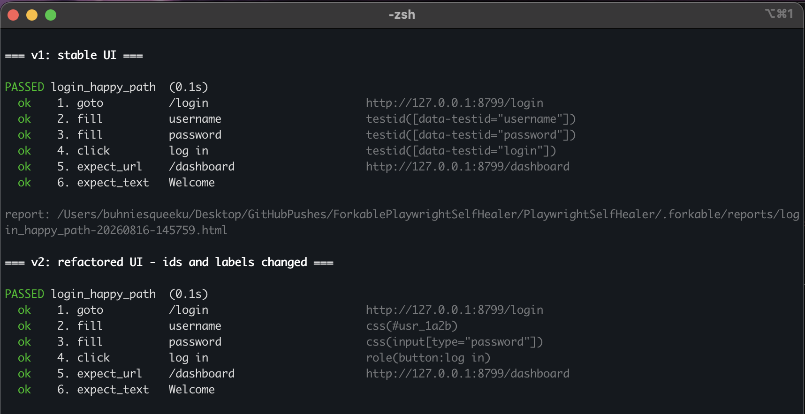

#PlaywrightSelfHealer


**Self-healing Playwright tests in Python.** Write tests in plain English, run
them against real browsers, and let the suite repair the locators your app
broke — heuristic-first, LLM-assisted, with no cloud API, no network and no
telemetry.

> Python · Playwright · Ollama · RAG · pytest · offline-first




*Same spec, same command. Between the two runs every `data-testid` was deleted
and every id renamed — the locators re-bind and the repair is remembered.*

The design constraint that shaped everything: **it must work on a machine with
the network cable pulled out.** Not "works offline once warmed up" — the socket
layer is patched so a non-loopback connection raises before a packet leaves the
process.

## How much of this is AI?

Worth being precise, because "AI agent" is doing a lot of unearned work in this
corner of the ecosystem.

| Part | What it actually is |
| --- | --- |
| Planning | One LLM call, English to JSON — or a regex grammar when no model is loaded |
| Locator resolution | A deterministic ladder of candidate strategies. No model involved |
| Healing | Fuzzy token scoring over a DOM snapshot; the model is consulted only to break ties |
| Failure analysis | Regex classification plus retrieval; the model writes the prose, not the verdict |
| Memory | Genuinely adaptive — proven locators change what later runs do |

There is no goal decomposition, no tool selection and no observe-replan-retry
loop. It executes a plan; it does not pursue an objective. The demo above ran
with **zero LLM calls** — the rule grammar planned it and the heuristic scorer
healed it.

That ordering is the design, not a shortfall: the deterministic path is
reproducible in CI, costs microseconds, and on the common failure — an id churn
where the label survived — it is simply correct. A local model makes the
planning more flexible and the diagnoses more readable. It is an accelerant, not
the mechanism.

## Why the plan holds no selectors

A step carries `target: "username"`, never `#username`. Binding happens at run
time against the live DOM, through an ordered ladder:

```
data-testid → ARIA role + accessible name → label → placeholder → id/name → text → css path
```

If every rung misses, the healer takes a compact DOM snapshot and scores each
element against the description with a fuzzy token match — `password` still
matches `passphrase` on a shared prefix, `username` still matches `user name` on
substring. The winning selector is written to `.forkable/memory.json`, so the
next run tries it first and healing stays cold.

A local model is consulted **only** when the best heuristic score is weak. That
ordering is deliberate: the deterministic scorer is reproducible in CI, costs
microseconds, and on the common failure — an id churn where the label survived —
it is simply correct.

## Install

```bash
pip install -e ".[dev,visual]"
python -m playwright install chromium     # once, needs network
forkable doctor
```

Optional, for better plans and richer failure analysis:

```bash
ollama pull qwen2.5-coder:14b
ollama pull nomic-embed-text
forkable index
```

Without Ollama, everything still runs — a deterministic rule grammar plans and a
stdlib hashing embedder powers retrieval.

Or skip the install entirely:

```bash
docker compose up agent              # tests, no model, fully offline
docker compose --profile llm up      # adds a local Ollama on the same bridge
```

The image pins the browser *and* its fonts, which is what makes visual baselines
reproducible between a laptop and CI.

## Use

```bash
forkable doctor                  # offline readiness
forkable serve                   # bundled demo target on 127.0.0.1:8799
forkable index                   # build the local RAG index
forkable ask "why did my selector break?"

forkable plan "go to the login page, fill username with demo, click log in"
forkable run  --file examples/nl_specs/login.txt
forkable run  --file examples/nl_specs/login.txt --variant v2   # force healing
forkable generate --file examples/nl_specs/login.txt --show
forkable heal-report
forkable demo                    # both variants back to back
```

Every command takes `--allow-network` if you genuinely need to reach outside;
without it, the guard is armed.

## What the agent does

| Capability | How |
| --- | --- |
| Natural language → tests | One LLM call, or a deterministic regex grammar covering ~20 phrasing families |
| Self-healing locators | Candidate ladder → fuzzy DOM scoring → optional LLM tie-break → persisted cache. The first two rungs need no model |
| AI-assisted generation | Plan → pytest + Playwright source, preferring locators proven on a real page |
| Failure analysis | Rule classification decides the category; RAG grounds it; the model only narrates |
| Visual validation | Pillow pixel diff with tolerance, red-overlay heatmaps, baseline management |
| Cross-browser | Chromium verified end to end. Firefox and WebKit are wired via `--browser` but untested — see Known nuances |
| API + UI | `api_request` / `expect_status` / `expect_json` steps run through `page.request`, sharing the browser's cookie jar |
| Regression + CI | `pytest -m "not e2e"` needs no browser and no model |
| Context-aware execution | Locator memory is scoped per page path, so the same description can bind differently per page |

## API and UI in one plan

`page.request` shares the browser's cookie jar, so a UI login authenticates the
API call that follows. That is the whole reason to keep them in one plan rather
than two suites:

```
go to the login page
fill username with demo
fill password with secret123
click log in
call GET /api/jobs
the response status should be 200
jobs.0.name should be nightly-ingest
the response count should be 3
```

`expect_json` walks a dotted path (`jobs.0.status`), and reports the available
keys when the path is wrong rather than an opaque `KeyError`.

## Generated code improves after a run

Before it has seen the page, the generator emits semantic locators derived from your
own words:

```python
page.get_by_role("textbox", name="username").fill("demo")
```

After a run it emits what actually bound:

```python
page.locator("[data-testid=\"username\"]").fill("demo")
```

Generated modules are parsed with `ast` and checked against an import and call
allowlist before being written. Model output is untrusted input and is treated
that way — `import subprocess`, `os.system`, `eval` and friends are rejected.

## Offline guarantee

`src/forkable_ai_agent/net_guard.py` patches `socket.connect`, `connect_ex`,
`create_connection` and `getaddrinfo`. Non-loopback addresses raise
`OfflineViolation`; DNS lookups for non-local names are refused outright.
Enforcement lives at the socket layer rather than in each client so it also
covers dependencies that were never asked to behave.

```bash
python scripts/verify_offline.py
```

```
outbound probes (all must be refused)
  ok    tcp to a public IP refused
  ok    dns lookup refused
  ok    tcp to a hostname refused
  ok    telemetry-style beacon refused
loopback must still work
  ok    demo target reachable on loopback
RESULT: PASS - nothing escaped
```

For a genuinely air-gapped machine, `scripts/bootstrap_offline.sh` builds a
transfer bundle (wheels + browser binaries) on a connected box and installs from
it with `--no-index` on the offline one.

## Degradation ladder

Nothing here hard-fails because a dependency is missing.

| Missing | Behaviour |
| --- | --- |
| Ollama daemon | Rule grammar plans; heuristic scorer heals |
| Embedding model | Stdlib hashing embedder; retrieval still works |
| Pillow | Visual checks warn instead of failing the run |
| Browser bundle | Planning, codegen, RAG and reporting still work |
| Knowledge index | Analyzer falls back to its built-in rule table |

## Testing

```bash
make test        # 125 tests
make test-e2e    # the 5 that need real Chromium
make ci          # everything the GitHub workflow runs, locally
make docker      # the suite inside the pinned Playwright image
```

`scripts/ci_local.sh` mirrors the workflow step for step. Run it before pushing:
a workflow cannot be tested until it is on GitHub, and this is how you find out
whether it will pass first.

Two fake servers keep coverage honest without network or hardware:

- `tests/support/fake_page.py` — a miniature headless browser that speaks HTTP
  to the real demo app and parses the real HTML, so healing stays covered on
  machines where a 150 MB browser download is not an option.
- `tests/support/fake_ollama.py` — serves the real Ollama endpoints with the
  real payload shapes on loopback, so plan generation, the healing tie-break,
  embeddings and failure narration are exercised over actual HTTP rather than
  against mock objects.

## Layout

```
src/forkable_ai_agent/
  net_guard.py        socket-level offline enforcement
  config.py           TOML + env settings
  schema.py           Step / TestPlan / RunResult / Diagnosis
  cli.py              argparse entry point
  llm/                ollama client, deterministic rule engine
  rag/                chunker, embeddings, BM25, vector store, retriever
  browser/            locator ladder, DOM snapshot, Playwright session
  agent/              planner, healer, executor, generator, analyzer, memory
  visual/             baseline management and pixel diffing
  reporting/          self-contained HTML + JSON reports
  testapp/            the offline demo target, its v2 refactor variant and JSON API
knowledge/            the corpus the RAG layer retrieves from
tests/                unit, integration and e2e suites
```

## Relationship to ForkedUpAIExperiments

Built to sit alongside
[ForkedUpAIExperiments](https://github.com/suryakulshreshtha/ForkedUpAIExperiments),
and it reuses that stack's assumptions: Ollama on loopback, `qwen2.5-coder` for
generation, `nomic-embed-text` for embeddings. If a configured model is not
pulled, the client resolves against `ollama list` and picks the best available,
so a shared box needs no extra downloads.

The one deliberate divergence is the vector store. That project uses ChromaDB;
this one defaults to a JSONL store with a cosine scan, because a corpus of a few
hundred engineering notes does not justify a dependency tree that is painful to
mirror onto an air-gapped machine. If you want them to share a store, install
the extra and set `backend = "chroma"` in `config/agent.toml` —
`rag/chroma_store.py` is a drop-in with telemetry disabled.

## Known nuances

- Locator memory is namespaced. Set `memory_namespace` (or `FORKABLE_MEMORY_NS`)
  when two environments serve different DOMs at the same path — staging versus
  production, or the demo's own v1 and v2. `--variant` sets it automatically.
- Font rendering differs between machines, so visual baselines should be
  produced in the same container that verifies them.
- The healer repairing a selector is a bug report against the app. The durable
  fix is adding a `data-testid`, not letting the resolver guess forever.
- Only Chromium is verified. Firefox and WebKit are wired and should work, but
  no run has proved it — treat `--browser firefox` as untested until you try it.
- The Python package is still `forkable_ai_agent`. The import path is not a
  marketing surface, and renaming it would churn every module for no gain.
